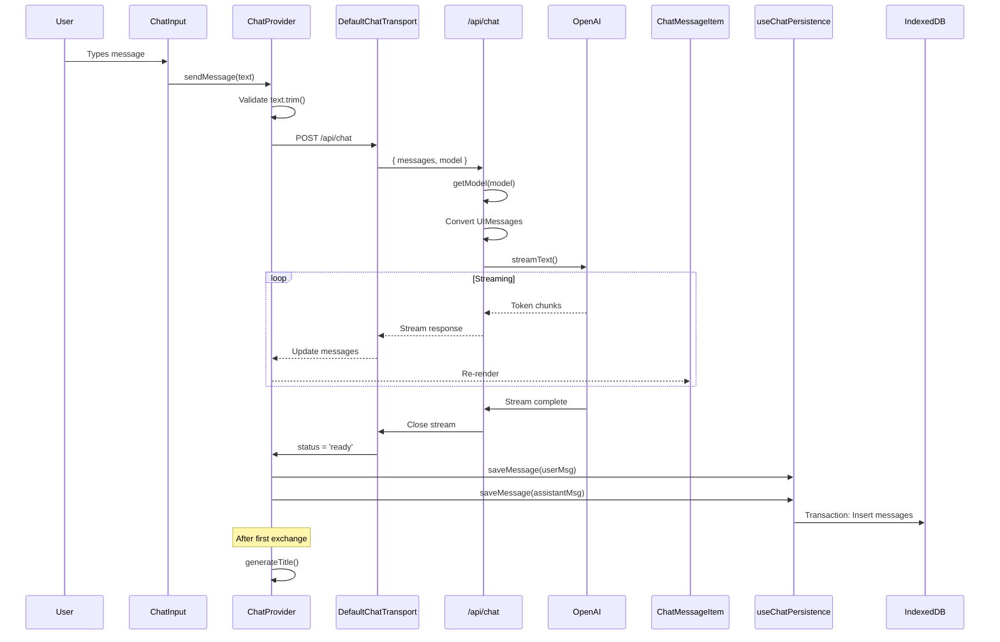
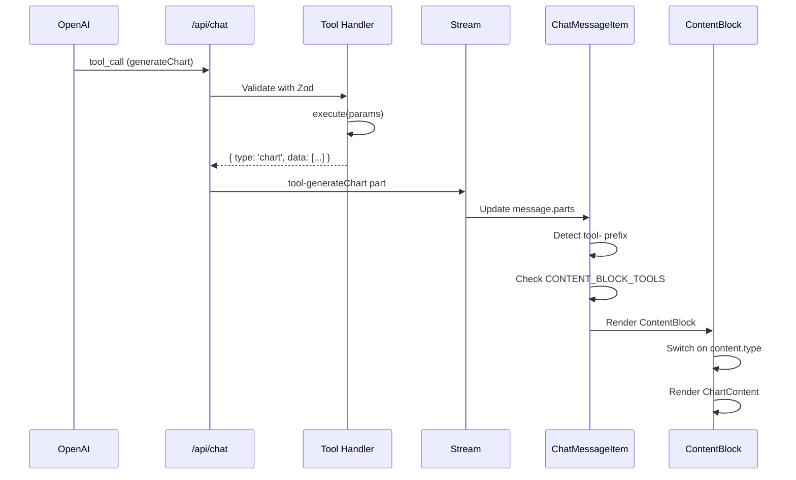
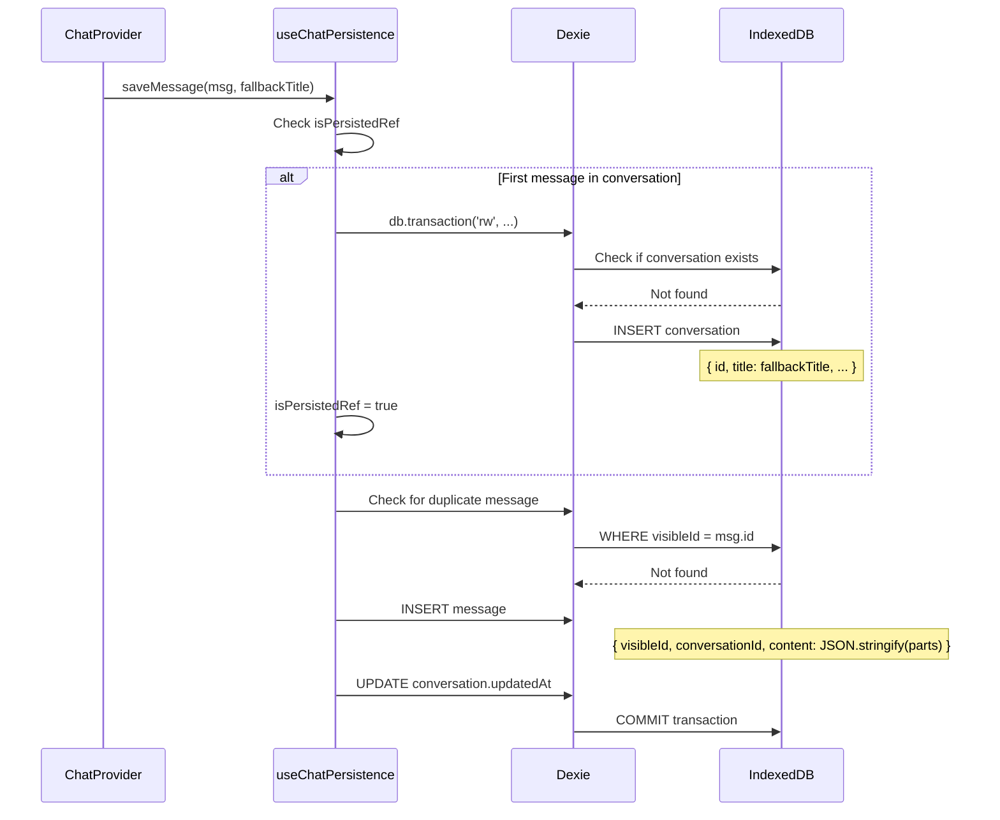
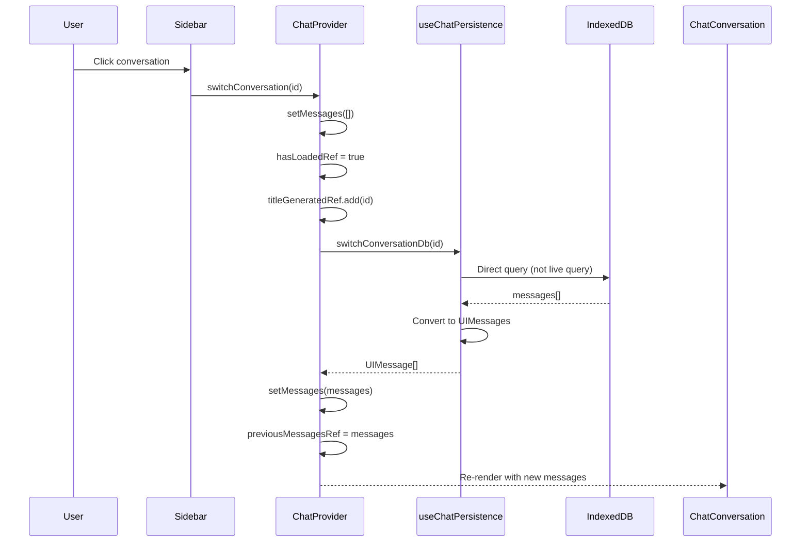
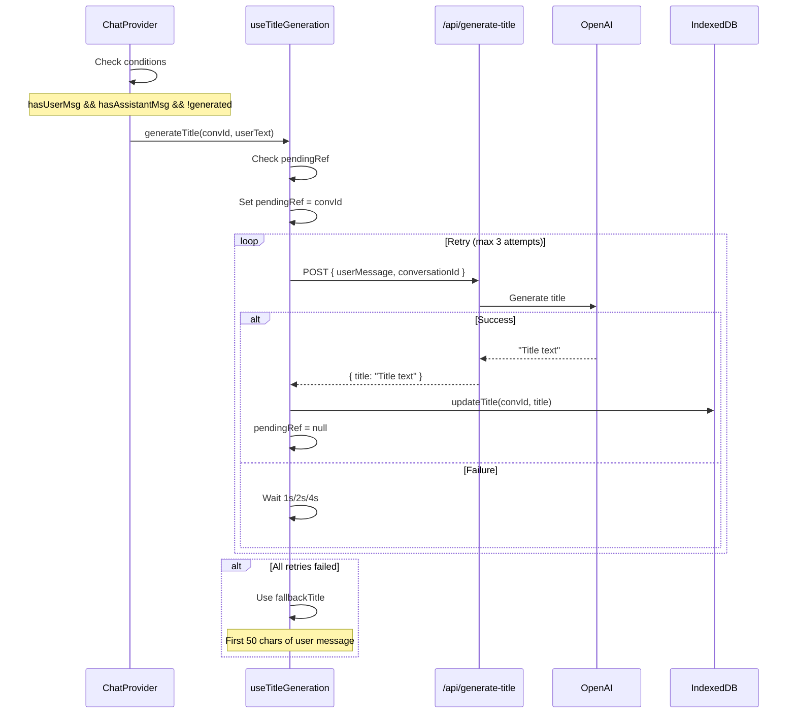
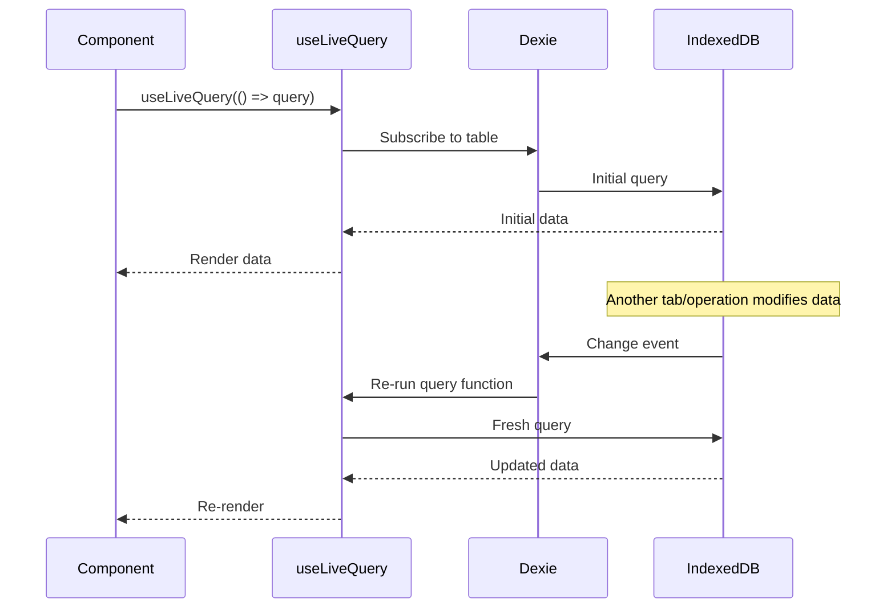

# Data Flow

This document describes how data flows through the application for common operations.

## Message Lifecycle

The complete flow from user input to persisted message:



### Step-by-Step Breakdown

#### 1. User Input

```typescript
// ChatInput.tsx
const handleSubmit = () => {
  if (text.trim()) {
    sendMessage(text);
    setText('');
  }
};
```

#### 2. Context Provider

```typescript
// ChatProvider.tsx
const sendMessage = useCallback((text: string) => {
  if (!text.trim()) return;
  chat.sendMessage({ text });
}, [chat]);
```

#### 3. API Route

```typescript
// /api/chat/route.ts
export async function POST(request: Request) {
  const { messages, model: selectedModel } = await request.json();

  const result = streamText({
    model: getModel(selectedModel),
    system: SYSTEM_PROMPT,
    messages: convertToModelMessages(messages),
    tools: chatTools,
    stopWhen: stepCountIs(3),
  });

  return result.toUIMessageStreamResponse();
}
```

#### 4. Persistence

```typescript
// ChatProvider.tsx useEffect
if (status === 'ready') {
  const newMessages = messages.filter(m => !previousIds.has(m.id));
  for (const message of newMessages) {
    await saveMessage(message, fallbackTitle);
  }
}
```

## Tool Execution Flow

When the AI decides to use a tool:



### Tool Execution Code

```typescript
// src/lib/ai/tools.ts
export const generateChart = tool<ChartContentData, ChartContentData>({
  description: "Generate a data visualization chart",
  inputSchema: ChartContentDataSchema,
  execute: async (input) => input, // Pass-through pattern
});
```

### Tool Result Rendering

```typescript
// ChatMessageItem.tsx
const CONTENT_BLOCK_TOOLS = [
  'generateForm',
  'generateChart',
  'generateCode',
  'generateCard',
];

// In render
if (part.type.startsWith('tool-')) {
  const toolName = part.type.replace('tool-', '');
  if (CONTENT_BLOCK_TOOLS.includes(toolName)) {
    if (toolPart.state === 'output-available') {
      return <ContentBlock content={toolPart.output} />;
    }
  }
}
```

## Persistence Flow

How messages are saved to IndexedDB:



### Delayed Conversation Creation

```typescript
// useChatPersistence.ts
const saveMessage = useCallback(async (message, fallbackTitle) => {
  await db.transaction('rw', db.messages, db.conversations, async () => {
    // Only create conversation on first save
    if (!isPersistedRef.current) {
      const existing = await db.conversations.get(currentConversationId);
      if (!existing) {
        await db.conversations.put({
          id: currentConversationId,
          title: fallbackTitle || 'New Chat',
          createdAt: new Date(),
          updatedAt: new Date(),
        });
      }
      isPersistedRef.current = true;
    }

    // Check for duplicate
    const duplicate = await db.messages
      .where('conversationId')
      .equals(currentConversationId)
      .filter(m => m.visibleId === message.id)
      .first();

    if (duplicate) return;

    // Insert message
    await db.messages.add({
      visibleId: message.id,
      conversationId: currentConversationId,
      role: message.role,
      content: JSON.stringify(message.parts),
      createdAt: new Date(),
    });

    await db.conversations.update(currentConversationId, {
      updatedAt: new Date(),
    });
  });
}, [currentConversationId]);
```

## Conversation Switching Flow

When user clicks a conversation in the sidebar:



### Why Direct Query?

The `switchConversation` function uses a direct database query instead of the live query to avoid UI flicker:

```typescript
// useChatPersistence.ts
const switchConversation = useCallback(async (id: string) => {
  // Direct fetch bypasses live query reactivity lag
  const records = await db.messages
    .where('conversationId')
    .equals(id)
    .sortBy('createdAt');

  return records.map(convertToUIMessage);
}, []);
```

## Title Generation Flow

After the first user+assistant exchange:



### Retry Logic

```typescript
// useTitleGeneration.ts
const generateTitle = async (conversationId: string, userMessage: string) => {
  const fallbackTitle = generateFallbackTitle(userMessage);
  let attempts = 0;
  const maxAttempts = 3;
  const baseDelay = 1000;

  const attemptGeneration = async (): Promise<string> => {
    try {
      const response = await fetch(getApiUrl('generate-title'), {
        method: 'POST',
        body: JSON.stringify({ userMessage, conversationId }),
      });
      const data = await response.json();
      return data.title || fallbackTitle;
    } catch (error) {
      attempts++;
      if (attempts < maxAttempts) {
        // Exponential backoff: 1s, 2s, 4s
        const delay = baseDelay * Math.pow(2, attempts - 1);
        await new Promise(r => setTimeout(r, delay));
        return attemptGeneration();
      }
      return fallbackTitle;
    }
  };

  const title = await attemptGeneration();
  onTitleGenerated?.(conversationId, title);
};
```

## Live Query Updates

How the UI stays in sync with database changes:



### Live Query Example

```typescript
// useChatPersistence.ts
const storedMessages = useLiveQuery(
  () => db.messages
    .where('conversationId')
    .equals(currentConversationId)
    .sortBy('createdAt'),
  [currentConversationId] // Dependency array
);
```

!!! note "Reactivity Lag"
    Live queries have a small delay (~100ms) when data changes. For user-triggered actions like conversation switching, use direct queries for immediate feedback.
