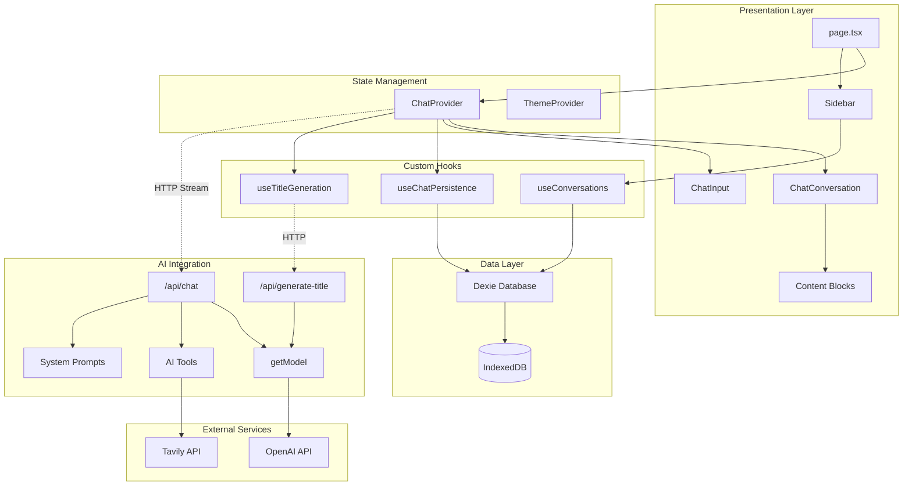
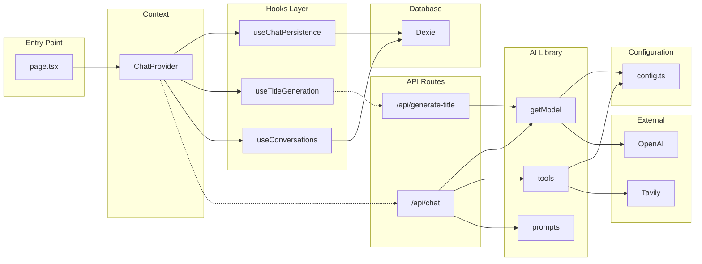

# Architecture Overview

This document provides a high-level overview of the AI Chatbot application architecture, including the dependency graph, module responsibilities, and key design decisions.

## High-Level Architecture

The application follows a **modular monolith** architecture with clear separation between:

- **Presentation Layer**: React components with AI SDK UI elements
- **State Management**: Context providers and custom hooks
- **AI Integration**: Model factory, tools, and streaming
- **Persistence**: IndexedDB via Dexie



## Module Responsibilities

### Presentation Layer

| Module | Location | Responsibility |
|--------|----------|----------------|
| **page.tsx** | `src/app/page.tsx` | Main entry point, renders WelcomeScreen or ChatConversation |
| **ChatConversation** | `src/components/chat/ChatConversation.tsx` | Message list with auto-scroll |
| **ChatMessageItem** | `src/components/chat/ChatMessageItem.tsx` | Individual message rendering, tool result routing |
| **ChatInput** | `src/components/chat/ChatInput.tsx` | Input composer with model selector |
| **Sidebar** | `src/components/layout/Sidebar.tsx` | Navigation, conversation list, settings |
| **Content Blocks** | `src/components/blocks/` | Form, Chart, Code, Card renderers |

### State Management

| Module | Location | Responsibility |
|--------|----------|----------------|
| **ChatProvider** | `src/components/chat/ChatProvider.tsx` | Central context for chat state, AI SDK integration, persistence orchestration |
| **ThemeProvider** | `src/components/providers/ThemeProvider.tsx` | Dark/light mode management |

### Custom Hooks

| Hook | Location | Responsibility |
|------|----------|----------------|
| **useChatPersistence** | `src/hooks/useChatPersistence.ts` | Message save/load, delayed conversation creation |
| **useConversations** | `src/hooks/useConversations.ts` | Conversation list CRUD operations |
| **useTitleGeneration** | `src/hooks/useTitleGeneration.ts` | LLM title generation with retry logic |

### AI Integration

| Module | Location | Responsibility |
|--------|----------|----------------|
| **/api/chat** | `src/app/api/chat/route.ts` | Streaming chat endpoint, tool execution |
| **/api/generate-title** | `src/app/api/generate-title/route.ts` | Title generation endpoint |
| **getModel** | `src/lib/ai/model.ts` | Model factory with middleware support |
| **tools** | `src/lib/ai/tools.ts` | 5 AI tool definitions |
| **prompts** | `src/lib/ai/prompts.ts` | System prompts with tool guidance |

### Data Layer

| Module | Location | Responsibility |
|--------|----------|----------------|
| **Dexie Schema** | `src/lib/db/schema.ts` | Database tables and indexes |
| **Types** | `src/lib/db/types.ts` | TypeScript interfaces for records |

## Dependency Graph



## Design Decisions

### 1. Provider Pattern for State Management

**Decision**: Use React Context via `ChatProvider` instead of external state management libraries.

**Rationale**:

- AI SDK's `useChat` hook provides most state management out of the box
- Single provider simplifies state coordination between chat, persistence, and title generation
- No additional dependencies (Redux, Zustand, etc.)

**Trade-offs**:

- Re-renders propagate to all consumers (acceptable for chat UI)
- Cannot easily share state across multiple provider instances

### 2. Local-First with IndexedDB

**Decision**: Store conversations and messages in IndexedDB via Dexie instead of a backend database.

**Rationale**:

- Works offline
- No server infrastructure required for persistence
- Instant data access
- User owns their data

**Trade-offs**:

- Data lost if browser storage is cleared
- No cross-device sync (would require additional backend)
- Storage limits vary by browser (~1GB Safari, ~60% disk Chrome)

### 3. Delayed Conversation Creation

**Decision**: Only create conversation records in the database after the first message is sent.

**Rationale**:

- Prevents orphan conversations when users open the app but don't chat
- All conversations in the database have at least one message
- Simplifies UI logic (no empty state handling)

**Implementation**: See [Persistence Module](../modules/persistence.md#delayed-conversation-creation).

### 4. Tool-Based AI Architecture

**Decision**: Implement interactive content (forms, charts, code blocks) as AI tools rather than markdown parsing.

**Rationale**:

- Type-safe data structures via Zod schemas
- Clear separation between tool definition and rendering
- AI can choose appropriate tool based on user intent
- Easily extensible (add new tools without changing rendering logic)

**Trade-offs**:

- Requires system prompt guidance for tool selection
- More complex than simple markdown rendering

### 5. Discriminated Unions for Content Blocks

**Decision**: Use TypeScript discriminated unions with Zod validation for tool outputs.

**Rationale**:

- Compile-time type safety
- Runtime validation prevents invalid data
- Exhaustive switch cases catch missing block types
- Self-documenting code

**Example**:

```typescript
type ContentBlock =
  | { type: "form"; ... }
  | { type: "chart"; ... }
  | { type: "code"; ... }
  | { type: "card"; ... };
```

### 6. Streaming Responses

**Decision**: Use AI SDK's streaming capabilities for real-time response rendering.

**Rationale**:

- Better perceived performance
- Users see content as it's generated
- Can stop generation mid-stream

**Implementation**: `streamText()` + `toUIMessageStreamResponse()` in API route.

### 7. Factory Pattern for Models

**Decision**: Use `getModel()` factory function instead of direct model instantiation.

**Rationale**:

- Centralized model configuration
- Easy to add middleware (DevTools in development)
- Validates model IDs against catalog
- Switches API mode based on model capabilities

## Architecture Strengths

1. **Clear Module Boundaries**: Chat, AI, persistence, and UI are well-isolated
2. **Type Safety**: TypeScript + Zod throughout the stack
3. **Extensibility**: Adding new tools follows a clear pattern
4. **Performance**: Streaming responses, lazy initialization
5. **Resilience**: Retry logic, fallback titles, transaction safety

## Areas for Improvement

1. **Error Boundaries**: No React error boundaries around components
2. **Test Coverage**: No automated tests
3. **Pagination**: All messages loaded at once for a conversation
4. **Storage Monitoring**: No warning when approaching IndexedDB limits

See [Modules](../modules/index.md) for detailed documentation of each system.
