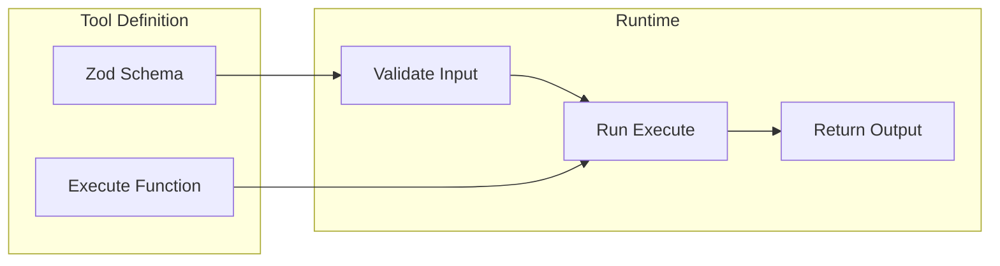
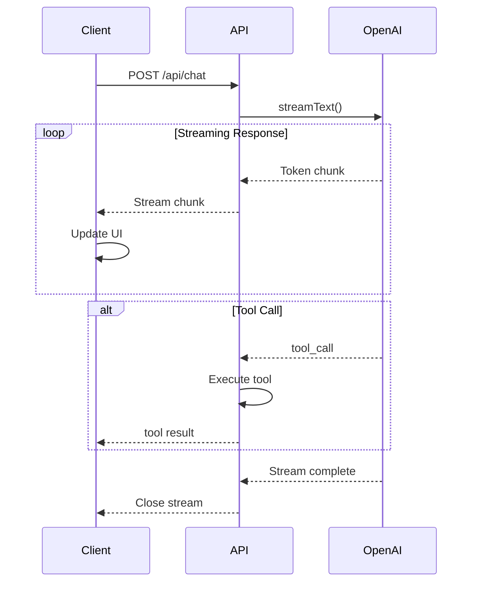

# AI Integration

The AI Integration module handles model creation, tool definitions, system prompts, and streaming responses.

## Overview

```mermaid
graph TB
    subgraph Client["Client Side"]
        Provider[ChatProvider]
        Transport[DefaultChatTransport]
    end

    subgraph API["API Route"]
        Route[/api/chat]
        GetModel[getModel]
        StreamText[streamText]
    end

    subgraph Tools["AI Tools"]
        Form[generateForm]
        Chart[generateChart]
        Code[generateCode]
        Card[generateCard]
        Search[webSearch]
    end

    subgraph External["External APIs"]
        OpenAI[OpenAI API]
        Tavily[Tavily API]
    end

    Provider --> Transport
    Transport -.->|HTTP POST| Route
    Route --> GetModel
    Route --> StreamText
    StreamText --> Tools
    GetModel --> OpenAI
    Search --> Tavily
```

## Model Factory

The `getModel()` function creates language model instances with consistent configuration.

**Location**: `src/lib/ai/model.ts`

```typescript
import { openai } from '@ai-sdk/openai';
import { wrapLanguageModel } from 'ai';
import { MODELS } from './models';
import { config } from '@/config';

export function getModel(modelId: string) {
  // Validate model ID
  const modelConfig = MODELS.find(m => m.id === modelId);
  if (!modelConfig) {
    throw new Error(`Unknown model: ${modelId}`);
  }

  // Create base model
  let model = openai(modelId, {
    // Use chat-completions for compatibility
    simulateStreaming: false,
  });

  // Wrap with DevTools middleware in development
  if (config.ai.debug) {
    model = wrapLanguageModel({
      model,
      middleware: devToolsMiddleware,
    });
  }

  return model;
}
```

### Model Catalog

**Location**: `src/lib/ai/models.ts`

```typescript
export const MODELS = [
  { id: 'gpt-5', name: 'GPT-5', provider: 'openai' },
  { id: 'gpt-5-mini', name: 'GPT-5 Mini', provider: 'openai' },
  { id: 'gpt-4o', name: 'GPT-4o', provider: 'openai' },
  { id: 'gpt-4o-mini', name: 'GPT-4o Mini', provider: 'openai' },
] as const;

export const DEFAULT_MODEL = MODELS[0]; // GPT-5

export type ModelId = typeof MODELS[number]['id'];
```

## AI Tools

The application includes 5 AI tools for generating interactive content.

**Location**: `src/lib/ai/tools.ts`

### Tool Architecture



### Tool Definitions

#### generateForm

Creates interactive forms for data collection.

```typescript
export const generateForm = tool<FormContentData, FormContentData>({
  description: "Generate an interactive form for collecting user input",
  inputSchema: FormContentDataSchema,
  execute: async (input) => input, // Pass-through
});
```

**Schema**:

```typescript
const FormContentDataSchema = z.object({
  type: z.literal("form"),
  title: z.string(),
  description: z.string().optional(),
  fields: z.array(FormFieldSchema),
  submitLabel: z.string().optional(),
});

const FormFieldSchema = z.object({
  name: z.string(),
  label: z.string(),
  type: z.enum([
    "text", "textarea", "email", "number",
    "select", "checkbox", "radio", "date",
    "slider", "file"
  ]),
  placeholder: z.string().optional(),
  required: z.boolean().optional(),
  options: z.array(z.string()).optional(), // For select, radio
  min: z.number().optional(), // For slider
  max: z.number().optional(),
  step: z.number().optional(),
});
```

#### generateChart

Creates data visualizations using Recharts.

```typescript
export const generateChart = tool<ChartContentData, ChartContentData>({
  description: "Generate a data visualization chart",
  inputSchema: ChartContentDataSchema,
  execute: async (input) => input,
});
```

**Schema**:

```typescript
const ChartContentDataSchema = z.object({
  type: z.literal("chart"),
  chartType: z.enum(["line", "bar", "pie", "area"]),
  title: z.string(),
  description: z.string().optional(),
  data: z.array(z.object({
    label: z.string(),
    value: z.number(),
  })),
});
```

#### generateCode

Creates syntax-highlighted code blocks.

```typescript
export const generateCode = tool<CodeContentData, CodeContentData>({
  description: "Generate a syntax-highlighted code block",
  inputSchema: CodeContentDataSchema,
  execute: async (input) => input,
});
```

**Schema**:

```typescript
const CodeContentDataSchema = z.object({
  type: z.literal("code"),
  language: z.string(),
  filename: z.string().optional(),
  code: z.string(),
  editable: z.boolean().optional(),
  showLineNumbers: z.boolean().optional(),
});
```

#### generateCard

Creates rich content cards with optional media.

```typescript
export const generateCard = tool<CardContentData, CardContentData>({
  description: "Generate a rich content card",
  inputSchema: CardContentDataSchema,
  execute: async (input) => input,
});
```

**Schema**:

```typescript
const CardContentDataSchema = z.object({
  type: z.literal("card"),
  title: z.string(),
  description: z.string().optional(),
  content: z.string().optional(),
  media: z.object({
    type: z.enum(["image", "video"]),
    url: z.string(),
    alt: z.string().optional(),
  }).optional(),
  actions: z.array(z.object({
    label: z.string(),
    action: z.string(),
    variant: z.enum(["default", "secondary", "destructive", "outline"]).optional(),
  })).optional(),
});
```

#### webSearch

Searches the web using Tavily API (optional).

```typescript
// src/lib/ai/tavily.ts
export const webSearch = tool({
  description: "Search the web for current information",
  inputSchema: z.object({
    query: z.string(),
    topic: z.enum(["general", "news", "finance"]).optional(),
    maxResults: z.number().min(1).max(10).optional(),
  }),
  execute: async ({ query, topic, maxResults }) => {
    const client = getClient(); // Lazy initialization
    const result = await client.search(query, {
      topic: topic || "general",
      maxResults: maxResults || 5,
    });
    return {
      query,
      answer: result.answer,
      results: result.results.map(r => ({
        title: r.title,
        url: r.url,
        content: r.content,
        score: r.score,
      })),
    };
  },
});
```

### Tool Export

```typescript
// src/lib/ai/tools.ts
export const chatTools = {
  generateForm,
  generateChart,
  generateCode,
  generateCard,
  // Conditionally include web search
  ...(config.ai.webSearch.enabled ? { webSearch } : {}),
};
```

## System Prompts

**Location**: `src/lib/ai/prompts.ts`

The system prompt guides the AI in selecting appropriate tools:

```typescript
export const SYSTEM_PROMPT = `You are a helpful assistant with access to tools for creating interactive content.

## Tool Selection Guide

You have 4 tools available. Choose the correct tool based on the user's intent:

### generateForm
USE WHEN: The user needs to COLLECT or INPUT data from someone.
- Trigger words: form, survey, questionnaire, registration, sign up...
- Creates: Interactive forms with text fields, dropdowns, checkboxes, etc.
- DO NOT use for: Displaying existing information, showing code

### generateChart
USE WHEN: The user wants to VISUALIZE numerical data or statistics.
- Trigger words: chart, graph, plot, visualize, statistics, trends...
- Creates: Line charts, bar charts, pie charts, or area charts
- DO NOT use for: Collecting user input, showing code

### generateCode
USE WHEN: The user asks for CODE or PROGRAMMING help.
- Trigger words: code, function, script, program, snippet...
- Creates: Syntax-highlighted code blocks
- DO NOT use for: Displaying non-code text, forms

### generateCard
USE WHEN: The user wants to DISPLAY or SHOWCASE structured information.
- Trigger words: card, summary, profile, product info, display...
- Creates: Rich content cards with optional images and action buttons
- DO NOT use for: Collecting input (use generateForm)

## Decision Examples

| User Request | Correct Tool |
|--------------|--------------|
| "Create a contact form" | generateForm |
| "Show sales data as a chart" | generateChart |
| "Write a Python function" | generateCode |
| "Create a product card" | generateCard |

## Important Guidelines

1. When you use a tool, do NOT repeat the tool's content in your text response.
2. Only provide brief context before the tool call or follow-up comments after.
3. If unsure which tool to use, consider the PRIMARY intent.
4. You can use multiple tools in a single response if needed.
5. If the request doesn't match any tool's purpose, respond with text.`;
```

## API Route

**Location**: `src/app/api/chat/route.ts`

```typescript
import { streamText, convertToModelMessages, stepCountIs } from 'ai';
import { getModel } from '@/lib/ai/model';
import { chatTools } from '@/lib/ai/tools';
import { SYSTEM_PROMPT } from '@/lib/ai/prompts';

export async function POST(request: Request) {
  const { messages, model: selectedModel } = await request.json();

  const result = streamText({
    model: getModel(selectedModel),
    system: SYSTEM_PROMPT,
    messages: convertToModelMessages(messages),
    tools: chatTools,
    stopWhen: stepCountIs(3), // Limit tool call loops
  });

  return result.toUIMessageStreamResponse();
}
```

### Request Format

```typescript
interface ChatRequest {
  messages: UIMessage[];
  model: string;
}
```

### Response Format

The response is a streaming response using the AI SDK's format:

- Text chunks are streamed as they arrive
- Tool calls are included as special message parts
- Tool results are streamed after execution

## Streaming Flow



## Adding a New Tool

See the [Adding AI Tools Tutorial](../tutorials/adding-ai-tools.md) for a complete guide.

Quick reference:

1. Define schema in `src/types/content-blocks.ts`
2. Create tool in `src/lib/ai/tools.ts`
3. Create renderer in `src/components/blocks/`
4. Register in `ContentBlock.tsx`
5. Update system prompt

## Related Modules

- [Chat System](chat-system.md) - How the API is called
- [Rendering Blocks](rendering-blocks.md) - How tool results are displayed
- [Tutorials](../tutorials/adding-ai-tools.md) - Step-by-step guide to adding tools
