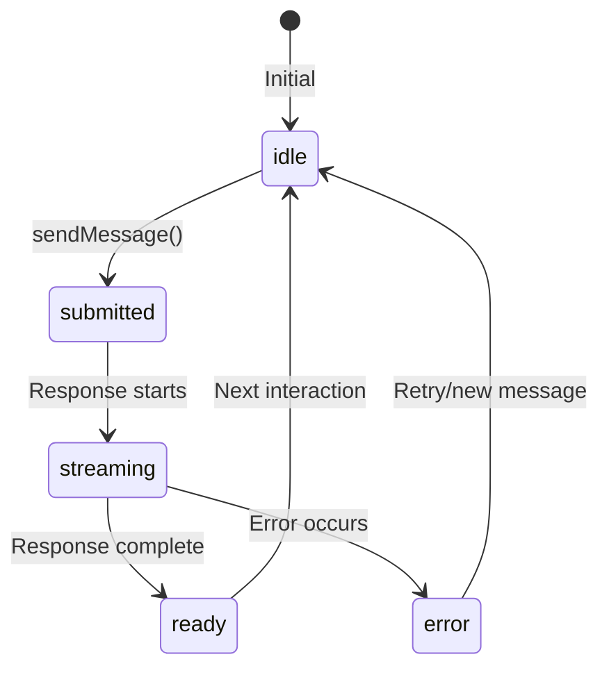

# Chat System

The Chat System module handles state management, message coordination, and serves as the central orchestration hub for the application.

## Overview

```mermaid
graph TB
    subgraph ChatProvider["ChatProvider Context"]
        Chat[AI SDK Chat]
        Persist[useChatPersistence]
        Title[useTitleGeneration]
        State[Local State]
    end

    subgraph Consumers["Context Consumers"]
        Input[ChatInput]
        Conv[ChatConversation]
        Sidebar[Sidebar]
    end

    subgraph External["External"]
        API[/api/chat]
        DB[(IndexedDB)]
    end

    Chat -.-> API
    Persist --> DB
    Title -.-> API

    Input --> ChatProvider
    Conv --> ChatProvider
    Sidebar --> ChatProvider
```

## ChatProvider

The `ChatProvider` component is the central context provider that orchestrates chat functionality.

**Location**: `src/components/chat/ChatProvider.tsx`

### Context API

```typescript
interface ChatContextType {
  // Messages
  messages: UIMessage[];
  setMessages: Dispatch<SetStateAction<UIMessage[]>>;

  // Actions
  sendMessage: (text: string) => void;
  clearMessages: () => void;
  stop: () => void;

  // Status
  status: 'idle' | 'submitted' | 'streaming' | 'ready' | 'error';
  isLoading: boolean;

  // Model selection
  selectedModel: string;
  setSelectedModel: Dispatch<SetStateAction<string>>;

  // Conversation management
  conversationId: string;
  switchConversation: (id: string) => Promise<void>;
  startNewConversation: () => Promise<void>;
}
```

### Usage

Access the context via the `useChat2()` hook:

```typescript
import { useChat2 } from '@/components/chat/ChatProvider';

function MyComponent() {
  const {
    messages,
    sendMessage,
    status,
    isLoading,
    conversationId,
  } = useChat2();

  const handleSend = () => {
    sendMessage('Hello, AI!');
  };

  return (
    <div>
      {messages.map(msg => (
        <div key={msg.id}>{msg.role}: {/* content */}</div>
      ))}
      <button onClick={handleSend} disabled={isLoading}>
        Send
      </button>
    </div>
  );
}
```

### Internal Structure

```typescript
export function ChatProvider({ children }: { children: React.ReactNode }) {
  // Model selection state
  const [selectedModel, setSelectedModel] = useState(DEFAULT_MODEL.id);

  // Persistence hook
  const {
    conversationId,
    storedMessages,
    saveMessage,
    updateMessage,
    createConversation,
    switchConversation: switchConversationDb,
    isPersisted,
  } = useChatPersistence();

  // Title generation hook
  const { generateTitle, generateFallbackTitle } = useTitleGeneration({
    onTitleGenerated: (id, title) => updateTitle(id, title),
  });

  // AI SDK Chat instance
  const chat = useMemo(() => new Chat({
    transport: new DefaultChatTransport({
      api: getApiUrl('chat'),
      body: { model: selectedModel },
    }),
  }), [selectedModel]);

  // AI SDK useChat hook
  const {
    messages,
    setMessages,
    sendMessage: sendChatMessage,
    status,
    stop,
  } = useChat({ chat });

  // Refs for race condition prevention
  const previousMessagesRef = useRef<UIMessage[]>([]);
  const hasLoadedRef = useRef(false);
  const titleGeneratedRef = useRef(new Set<string>());

  // ... effects and handlers
}
```

## State Management

### Message State Flow



### Status States

| Status | Description | UI Behavior |
|--------|-------------|-------------|
| `idle` | Waiting for input | Input enabled |
| `submitted` | Message sent, waiting | Input disabled |
| `streaming` | Response arriving | Show typing indicator |
| `ready` | Response complete | Trigger persistence |
| `error` | Error occurred | Show error message |

### Race Condition Prevention

The provider uses refs to prevent race conditions:

```typescript
// Prevent live query from overwriting during switch
const hasLoadedRef = useRef(false);

// Track saved messages to avoid duplicates
const previousMessagesRef = useRef<UIMessage[]>([]);

// Track which conversations have titles
const titleGeneratedRef = useRef(new Set<string>());
```

## Message Persistence

Messages are persisted after streaming completes:

```typescript
useEffect(() => {
  if (status !== 'ready') return;

  const previousIds = new Set(previousMessagesRef.current.map(m => m.id));
  const newMessages = messages.filter(m => !previousIds.has(m.id));

  if (newMessages.length === 0) return;

  // Generate fallback title from first user message
  const firstUserMsg = messages.find(m => m.role === 'user');
  const fallbackTitle = firstUserMsg
    ? generateFallbackTitle(getTextFromMessage(firstUserMsg))
    : 'New Chat';

  // Save each new message
  (async () => {
    for (const message of newMessages) {
      await saveMessage(message, fallbackTitle);
    }
    previousMessagesRef.current = messages;
  })();
}, [messages, status]);
```

## Title Generation

Titles are generated after the first user+assistant exchange:

```typescript
useEffect(() => {
  if (status !== 'ready') return;

  const userMsg = messages.find(m => m.role === 'user');
  const assistantMsg = messages.find(m => m.role === 'assistant');

  if (!userMsg || !assistantMsg) return;
  if (titleGeneratedRef.current.has(conversationId)) return;

  titleGeneratedRef.current.add(conversationId);
  generateTitle(conversationId, getTextFromMessage(userMsg));
}, [messages, status, conversationId]);
```

## Conversation Switching

```typescript
const switchConversation = useCallback(async (id: string) => {
  // Clear current messages immediately
  setMessages([]);

  // Prevent live query from interfering
  hasLoadedRef.current = true;

  // Don't regenerate existing titles
  titleGeneratedRef.current.add(id);

  // Fetch messages directly (bypass live query lag)
  const loadedMessages = await switchConversationDb(id);

  if (loadedMessages.length > 0) {
    setMessages(loadedMessages);
    previousMessagesRef.current = loadedMessages;
  }
}, [switchConversationDb, setMessages]);
```

## Key Patterns

### 1. Hook Composition

ChatProvider composes multiple hooks:

```typescript
// Persistence layer
const { saveMessage, ... } = useChatPersistence();

// Title generation layer
const { generateTitle, ... } = useTitleGeneration();

// AI SDK layer
const { messages, sendMessage, ... } = useChat({ chat });
```

### 2. Deferred Execution

Heavy operations are deferred to avoid blocking:

```typescript
// Title generation is async and non-blocking
generateTitle(conversationId, userText); // No await

// Persistence happens after streaming completes
if (status === 'ready') {
  // Save messages
}
```

### 3. Ref-based Tracking

Refs track state that shouldn't trigger re-renders:

```typescript
// Track saved messages without re-renders
const previousMessagesRef = useRef<UIMessage[]>([]);

// Check: have we saved this message?
const isSaved = previousMessagesRef.current.some(m => m.id === message.id);
```

## Common Operations

### Send a Message

```typescript
const { sendMessage, isLoading } = useChat2();

// In a handler
const handleSubmit = () => {
  if (!isLoading && text.trim()) {
    sendMessage(text);
    setText('');
  }
};
```

### Start New Conversation

```typescript
const { startNewConversation } = useChat2();

const handleNewChat = async () => {
  await startNewConversation();
};
```

### Switch Conversation

```typescript
const { switchConversation } = useChat2();

const handleSelect = async (conversationId: string) => {
  await switchConversation(conversationId);
};
```

### Stop Generation

```typescript
const { stop, status } = useChat2();

{status === 'streaming' && (
  <button onClick={stop}>Stop generating</button>
)}
```

## Related Modules

- [AI Integration](ai-integration.md) - How messages are processed
- [Persistence](persistence.md) - How messages are stored
- [Rendering Blocks](rendering-blocks.md) - How messages are displayed
