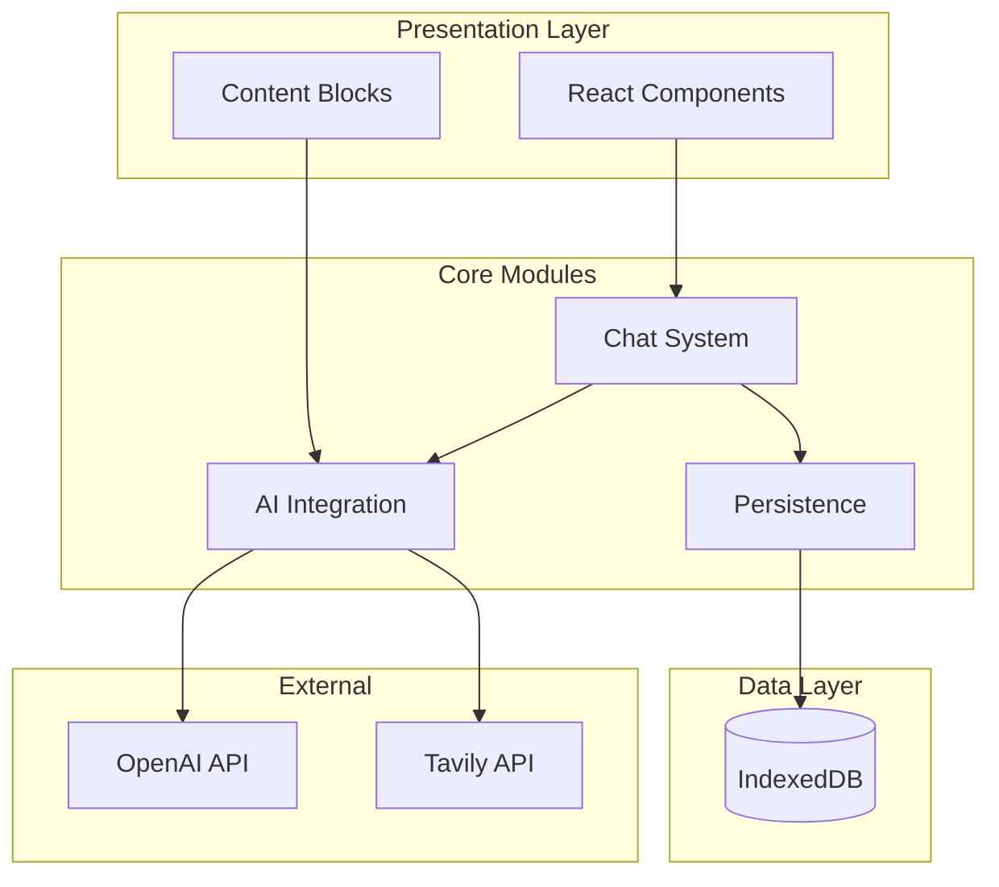
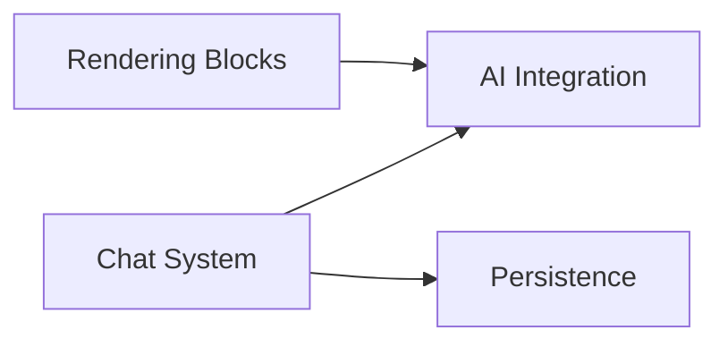

# Modules Overview

This section provides detailed documentation for each major module in the AI Chatbot application.

## Module Architecture

## Module Index

| Module | Description | Key Files |
|--------|-------------|-----------|
| [Chat System](chat-system.md) | State management, message handling, context provider | `ChatProvider.tsx`, `useChat2()` |
| [AI Integration](ai-integration.md) | Models, tools, prompts, streaming | `tools.ts`, `model.ts`, `/api/chat` |
| [Rendering Blocks](rendering-blocks.md) | Interactive content (forms, charts, code, cards) | `ContentBlock.tsx`, `FormContent.tsx` |
| [Persistence](persistence.md) | IndexedDB storage, hooks, delayed creation | `useChatPersistence.ts`, `schema.ts` |

## Quick Reference

### Where to Look For...

| Task | Module | Key Files |
|------|--------|-----------|
| Modify chat state | [Chat System](chat-system.md) | `ChatProvider.tsx` |
| Add a new AI tool | [AI Integration](ai-integration.md) | `tools.ts`, `content-blocks.ts` |
| Change how tools render | [Rendering Blocks](rendering-blocks.md) | `ContentBlock.tsx`, `*Content.tsx` |
| Modify database schema | [Persistence](persistence.md) | `schema.ts`, `types.ts` |
| Add new message fields | [Persistence](persistence.md) | `useChatPersistence.ts` |
| Change model selection | [AI Integration](ai-integration.md) | `models.ts`, `model.ts` |
| Modify streaming behavior | [AI Integration](ai-integration.md) | `/api/chat/route.ts` |

## Module Dependencies

- **Chat System** depends on AI Integration and Persistence
- **Rendering Blocks** depends on AI Integration (for type definitions)
- **Persistence** is independent (only depends on Dexie)
- **AI Integration** is independent (only depends on AI SDK)
