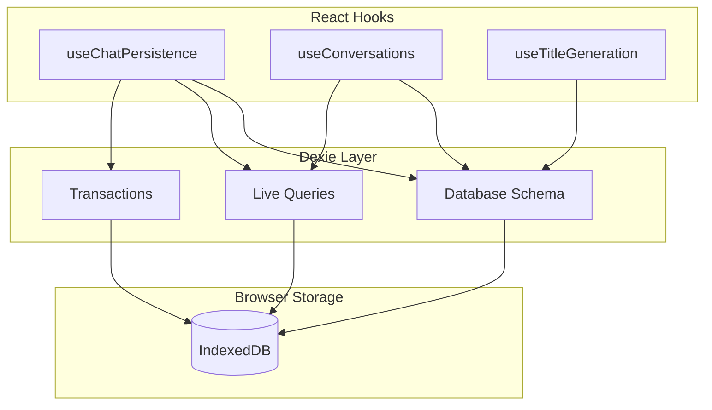
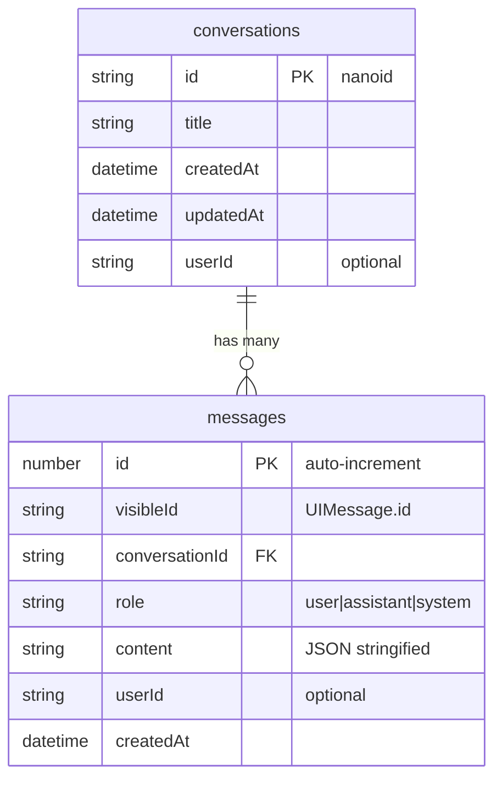
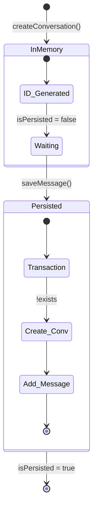
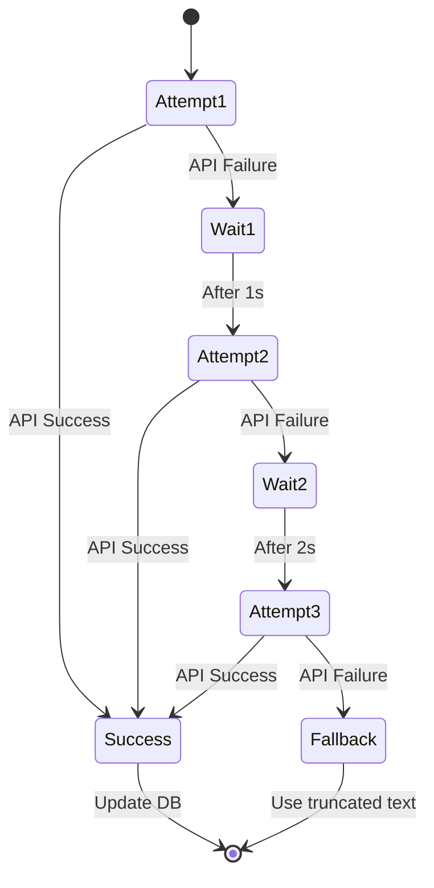

# Persistence

The Persistence module handles local data storage using IndexedDB via Dexie, providing conversation and message persistence.

## Overview



## Database Schema

**Location**: `src/lib/db/schema.ts`

```typescript
import Dexie, { type Table } from 'dexie';
import type { ConversationRecord, MessageRecord } from './types';

export class ChatDatabase extends Dexie {
  conversations!: Table<ConversationRecord, string>;
  messages!: Table<MessageRecord, number>;

  constructor() {
    super('AIChatbotDB');

    this.version(1).stores({
      conversations: 'id, updatedAt, userId',
      messages: '++id, conversationId, userId, createdAt',
    });
  }
}

export const db = new ChatDatabase();
```

### Schema Diagram



### Index Strategy

| Table | Index | Purpose |
|-------|-------|---------|
| `conversations` | `id` | Primary key lookup |
| `conversations` | `updatedAt` | Sort by most recent |
| `conversations` | `userId` | Multi-user filtering |
| `messages` | `id` | Primary key (auto-increment) |
| `messages` | `conversationId` | Fetch messages for a conversation |
| `messages` | `userId` | Multi-user filtering |
| `messages` | `createdAt` | Chronological sorting |

## Type Definitions

**Location**: `src/lib/db/types.ts`

```typescript
export interface ConversationRecord {
  id: string;           // nanoid generated
  title: string;        // LLM or fallback generated
  createdAt: Date;
  updatedAt: Date;      // Updated on each new message
  userId?: string;      // Placeholder for auth
}

export interface MessageRecord {
  id?: number;          // Auto-incremented by Dexie
  visibleId: string;    // Maps to UIMessage.id (from AI SDK)
  conversationId: string;
  role: 'user' | 'assistant' | 'system';
  content: string;      // JSON stringified UIMessage.parts
  userId?: string;
  createdAt: Date;
}
```

## useChatPersistence Hook

**Location**: `src/hooks/useChatPersistence.ts`

The main persistence hook handling message save/load operations.

### API

```typescript
interface UseChatPersistenceOptions {
  conversationId?: string;
  userId?: string;
}

interface UseChatPersistenceReturn {
  conversationId: string;
  storedMessages: UIMessage[];
  isLoading: boolean;
  isPersisted: boolean;
  saveMessage: (message: UIMessage, fallbackTitle?: string) => Promise<void>;
  updateMessage: (message: UIMessage) => Promise<void>;
  createConversation: () => Promise<string>;
  clearConversation: () => Promise<void>;
  deleteConversation: (id?: string) => Promise<void>;
  switchConversation: (id: string) => Promise<UIMessage[]>;
}
```

### Usage

```typescript
import { useChatPersistence } from '@/hooks/useChatPersistence';

function MyComponent() {
  const {
    conversationId,
    storedMessages,
    saveMessage,
    switchConversation,
    isPersisted,
  } = useChatPersistence();

  // Save a new message
  const handleSave = async (message: UIMessage) => {
    await saveMessage(message, 'Fallback Title');
  };

  // Switch to another conversation
  const handleSwitch = async (id: string) => {
    const messages = await switchConversation(id);
    // messages are returned for immediate use
  };
}
```

### Delayed Conversation Creation

A key pattern preventing orphan records:



**Implementation**:

```typescript
const saveMessage = useCallback(async (message: UIMessage, fallbackTitle?: string) => {
  await db.transaction('rw', db.messages, db.conversations, async () => {
    // Only create conversation on first message save
    if (!isPersistedRef.current) {
      const existingConv = await db.conversations.get(currentConversationId);
      if (!existingConv) {
        await db.conversations.put({
          id: currentConversationId,
          title: fallbackTitle || 'New Chat',
          createdAt: new Date(),
          updatedAt: new Date(),
          userId,
        });
      }
      isPersistedRef.current = true;
    }

    // Check for duplicate message
    const existing = await db.messages
      .where('conversationId')
      .equals(currentConversationId)
      .filter(msg => msg.visibleId === message.id)
      .first();

    if (existing) return;

    // Insert message
    await db.messages.add({
      visibleId: message.id,
      conversationId: currentConversationId,
      role: message.role,
      content: JSON.stringify(message.parts),
      userId,
      createdAt: new Date(),
    });

    // Update conversation timestamp
    await db.conversations.update(currentConversationId, {
      updatedAt: new Date(),
    });
  });
}, [currentConversationId, userId]);
```

**Benefits**:

- No orphan conversations (empty records)
- Simpler UI logic (all conversations have messages)
- Atomic operation ensures data integrity

## useConversations Hook

**Location**: `src/hooks/useConversations.ts`

Manages the conversation list for the sidebar.

### API

```typescript
interface UseConversationsOptions {
  userId?: string;
  limit?: number;  // Default: 50
}

interface UseConversationsReturn {
  conversations: ConversationRecord[];
  isLoading: boolean;
  updateTitle: (id: string, title: string) => Promise<void>;
  deleteConversation: (id: string) => Promise<void>;
  clearAllConversations: () => Promise<void>;
}
```

### Usage

```typescript
import { useConversations } from '@/hooks/useConversations';

function Sidebar() {
  const {
    conversations,
    isLoading,
    deleteConversation,
    updateTitle,
  } = useConversations({ limit: 50 });

  return (
    <ul>
      {conversations.map(conv => (
        <li key={conv.id}>
          {conv.title}
          <button onClick={() => deleteConversation(conv.id)}>
            Delete
          </button>
        </li>
      ))}
    </ul>
  );
}
```

### Cascade Delete

```typescript
const deleteConversation = useCallback(async (id: string) => {
  // Delete messages first (children)
  await db.messages.where('conversationId').equals(id).delete();
  // Then delete conversation (parent)
  await db.conversations.delete(id);
}, []);
```

## useTitleGeneration Hook

**Location**: `src/hooks/useTitleGeneration.ts`

Generates conversation titles via LLM with retry logic.

### API

```typescript
interface UseTitleGenerationOptions {
  onTitleGenerated?: (conversationId: string, title: string) => void;
  onError?: (error: Error) => void;
}

interface UseTitleGenerationReturn {
  generateTitle: (conversationId: string, userMessage: string) => Promise<void>;
  generateFallbackTitle: (userMessage: string) => string;
}
```

### Retry Logic



**Implementation**:

```typescript
const generateTitle = async (conversationId: string, userMessage: string) => {
  const fallbackTitle = generateFallbackTitle(userMessage);
  let attempts = 0;
  const maxAttempts = 3;
  const baseDelay = 1000; // 1 second

  const attemptGeneration = async (): Promise<string> => {
    try {
      const response = await fetch(getApiUrl('generate-title'), {
        method: 'POST',
        headers: { 'Content-Type': 'application/json' },
        body: JSON.stringify({ userMessage, conversationId }),
      });

      if (!response.ok) throw new Error('Title generation failed');

      const data = await response.json();
      return data.title || fallbackTitle;
    } catch (error) {
      attempts++;
      if (attempts < maxAttempts) {
        // Exponential backoff: 1s, 2s, 4s
        const delay = baseDelay * Math.pow(2, attempts - 1);
        await new Promise(resolve => setTimeout(resolve, delay));
        return attemptGeneration();
      }
      return fallbackTitle;
    }
  };

  const title = await attemptGeneration();
  onTitleGenerated?.(conversationId, title);
};

const generateFallbackTitle = (userMessage: string): string => {
  const maxLength = 50;
  if (userMessage.length <= maxLength) return userMessage;

  // Truncate at word boundary
  const truncated = userMessage.slice(0, maxLength);
  const lastSpace = truncated.lastIndexOf(' ');
  return lastSpace > 0
    ? truncated.slice(0, lastSpace) + '...'
    : truncated + '...';
};
```

## Live Query Pattern

Dexie's `useLiveQuery` provides reactive data subscriptions:

```typescript
import { useLiveQuery } from 'dexie-react-hooks';

// Automatically re-renders when data changes
const conversations = useLiveQuery(
  () => db.conversations
    .orderBy('updatedAt')
    .reverse()
    .limit(50)
    .toArray(),
  [] // Dependencies
);
```

### How It Works

1. Initial query runs and returns data
2. Hook subscribes to IndexedDB change events
3. When data changes (add, update, delete), query re-runs
4. Component re-renders with new data

### Bypassing Live Queries

For user-triggered actions needing immediate feedback:

```typescript
// Direct query (no subscription)
const switchConversation = async (id: string) => {
  const messages = await db.messages
    .where('conversationId')
    .equals(id)
    .sortBy('createdAt');

  return messages; // Use immediately
};
```

**When to use direct queries**:

- Conversation switching (avoid reactivity lag)
- One-time data fetches
- Immediate user feedback needed

## Transaction Handling

Dexie transactions provide ACID guarantees:

```typescript
await db.transaction('rw', db.messages, db.conversations, async () => {
  // All operations succeed or all fail

  // 1. Create conversation
  await db.conversations.put({ ... });

  // 2. Add message
  await db.messages.add({ ... });

  // 3. Update timestamp
  await db.conversations.update(id, { updatedAt: new Date() });

  // If any operation fails, all are rolled back
});
```

**Transaction modes**:

| Mode | Description |
|------|-------------|
| `r` | Read-only |
| `rw` | Read-write |
| `rw!` | Read-write with upgrade |

## CRUD Operations Summary

### Create

```typescript
// Create conversation (usually via saveMessage)
await db.conversations.put({
  id: nanoid(),
  title: 'New Chat',
  createdAt: new Date(),
  updatedAt: new Date(),
});

// Create message
await db.messages.add({
  visibleId: message.id,
  conversationId,
  role: message.role,
  content: JSON.stringify(message.parts),
  createdAt: new Date(),
});
```

### Read

```typescript
// Get single conversation
const conv = await db.conversations.get(id);

// Get all messages for conversation
const messages = await db.messages
  .where('conversationId')
  .equals(id)
  .sortBy('createdAt');

// Get conversations sorted by date
const convs = await db.conversations
  .orderBy('updatedAt')
  .reverse()
  .limit(50)
  .toArray();
```

### Update

```typescript
// Update conversation title
await db.conversations.update(id, { title: 'New Title' });

// Update message content
await db.messages.update(messageId, {
  content: JSON.stringify(newParts),
});
```

### Delete

```typescript
// Delete single conversation (with cascade)
await db.messages.where('conversationId').equals(id).delete();
await db.conversations.delete(id);

// Delete all conversations
await db.messages.clear();
await db.conversations.clear();
```

## Schema Migrations

When adding new fields or tables, increment the version:

```typescript
export class ChatDatabase extends Dexie {
  constructor() {
    super('AIChatbotDB');

    // Version 1 - Initial schema
    this.version(1).stores({
      conversations: 'id, updatedAt, userId',
      messages: '++id, conversationId, userId, createdAt',
    });

    // Version 2 - Add tags
    this.version(2).stores({
      conversations: 'id, updatedAt, userId, *tags', // Multi-entry index
      messages: '++id, conversationId, userId, createdAt',
    }).upgrade(tx => {
      // Migration: initialize tags for existing conversations
      return tx.table('conversations').toCollection().modify(conv => {
        conv.tags = [];
      });
    });
  }
}
```

See the [Extending Persistence Tutorial](../tutorials/extending-persistence.md) for a complete guide.

## Browser Storage Limits

| Browser | Limit |
|---------|-------|
| Chrome | ~60% of available disk space |
| Firefox | ~50% of available disk space |
| Safari | ~1GB per origin |
| Edge | Same as Chrome |

!!! warning "Storage Persistence"
    IndexedDB data can be cleared by the browser or user. Consider implementing cloud sync for critical data.

## Related Modules

- [Chat System](chat-system.md) - How persistence integrates with chat
- [Tutorials](../tutorials/extending-persistence.md) - Adding new fields
