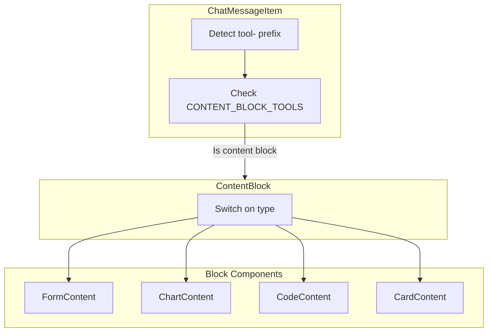
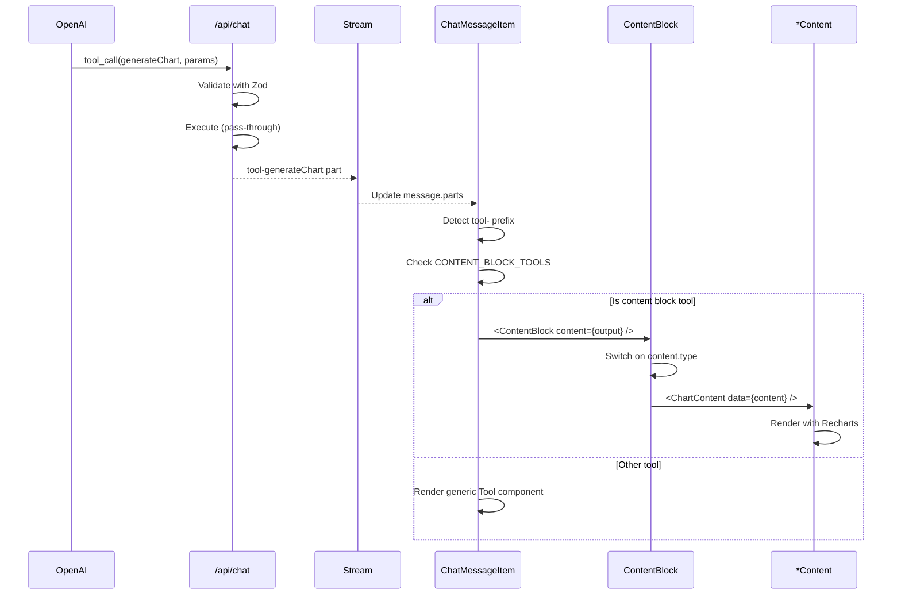

# Rendering Blocks

The Rendering Blocks module handles the display of interactive content generated by AI tools.

## Overview



## Content Block Types

**Location**: `src/types/content-blocks.ts`

The content block types use a discriminated union pattern for type safety:

```typescript
// Discriminated union type
export type ContentBlock =
  | FormContentData
  | ChartContentData
  | CodeContentData
  | CardContentData;

// Zod schema for runtime validation
export const ContentBlockSchema = z.discriminatedUnion("type", [
  FormContentDataSchema,
  ChartContentDataSchema,
  CodeContentDataSchema,
  CardContentDataSchema,
]);
```

This pattern ensures:

- TypeScript narrows the type based on the `type` field
- Exhaustive switch statements catch missing cases
- Runtime validation with Zod schemas

## Tool Detection

**Location**: `src/components/chat/ChatMessageItem.tsx`

The message renderer detects tool outputs and routes them to the appropriate block:

```typescript
const CONTENT_BLOCK_TOOLS = [
  'generateForm',
  'generateChart',
  'generateCode',
  'generateCard',
];

// In the render function
{message.parts?.map((part, index) => {
  // Check for tool parts
  if (part.type.startsWith('tool-')) {
    const toolName = part.type.replace('tool-', '');

    // Route content block tools to ContentBlock
    if (CONTENT_BLOCK_TOOLS.includes(toolName)) {
      if (part.state === 'output-available' && part.output) {
        return (
          <ContentBlock
            key={index}
            content={part.output as ContentBlock}
            messageId={message.id}
          />
        );
      }
      // Show loading state while tool executes
      return <ToolLoading key={index} toolName={toolName} />;
    }

    // Other tools use generic display
    return <Tool key={index} part={part} />;
  }

  // Text parts use Streamdown
  if (part.type === 'text') {
    return <Streamdown key={index} text={part.text} />;
  }
})}
```

## ContentBlock Dispatcher

**Location**: `src/components/blocks/ContentBlock.tsx`

The dispatcher routes content to the appropriate renderer:

```typescript
"use client";

import { motion } from "motion/react";
import type { ContentBlock as ContentBlockType } from "@/types/content-blocks";
import { FormContent } from "./FormContent";
import { ChartContent } from "./ChartContent";
import { CodeContent } from "./CodeContent";
import { CardContent } from "./CardContent";
import { fadeInUp } from "@/lib/motion/variants";

interface ContentBlockProps {
  content: ContentBlockType;
  messageId: string;
}

export function ContentBlock({ content, messageId }: ContentBlockProps) {
  const renderContent = () => {
    switch (content.type) {
      case "form":
        return <FormContent data={content} messageId={messageId} />;
      case "chart":
        return <ChartContent data={content} />;
      case "code":
        return <CodeContent data={content} />;
      case "card":
        return <CardContent data={content} />;
      default:
        // TypeScript ensures this is never reached
        return null;
    }
  };

  return (
    <motion.div
      initial="hidden"
      animate="visible"
      variants={fadeInUp}
      className="my-3 w-full"
    >
      {renderContent()}
    </motion.div>
  );
}
```

## Block Components

### FormContent

**Location**: `src/components/blocks/FormContent.tsx`

Renders interactive forms with validation and submission handling.

```typescript
interface FormContentProps {
  data: FormContentData;
  messageId: string;
}

export function FormContent({ data, messageId }: FormContentProps) {
  const [values, setValues] = useState<FormValues>(() =>
    initializeFormValues(data.fields)
  );
  const [submitted, setSubmitted] = useState(false);

  const handleSubmit = (e: React.FormEvent) => {
    e.preventDefault();

    // Validate required fields
    const missingFields = data.fields
      .filter(f => f.required && !values[f.name])
      .map(f => f.label);

    if (missingFields.length > 0) {
      toast.error(`Please fill in: ${missingFields.join(', ')}`);
      return;
    }

    console.log('Form submitted:', { messageId, values });
    toast.success('Form submitted successfully!');
    setSubmitted(true);
  };

  return (
    <Card>
      <CardHeader>
        <CardTitle>{data.title}</CardTitle>
        {data.description && (
          <CardDescription>{data.description}</CardDescription>
        )}
      </CardHeader>
      <CardContent>
        <form onSubmit={handleSubmit}>
          <motion.div variants={formFieldContainer}>
            {data.fields.map(field => (
              <motion.div key={field.name} variants={formField}>
                {renderField(field, values, setValues, submitted)}
              </motion.div>
            ))}
          </motion.div>
          <Button type="submit" disabled={submitted}>
            {data.submitLabel || 'Submit'}
          </Button>
        </form>
      </CardContent>
    </Card>
  );
}
```

**Supported Field Types**:

| Type | Component | Props |
|------|-----------|-------|
| `text` | Input | placeholder, required |
| `textarea` | Textarea | placeholder, required |
| `email` | Input (type="email") | placeholder, required |
| `number` | Input (type="number") | placeholder, required |
| `select` | Select | options, placeholder |
| `checkbox` | Checkbox | label |
| `radio` | RadioGroup | options |
| `date` | Input (type="date") | required |
| `slider` | Slider | min, max, step |
| `file` | Input (type="file") | - |

### ChartContent

**Location**: `src/components/blocks/ChartContent.tsx`

Renders data visualizations using Recharts.

```typescript
interface ChartContentProps {
  data: ChartContentData;
}

export function ChartContent({ data }: ChartContentProps) {
  // Transform data for Recharts
  const chartData = data.data.map(point => ({
    name: point.label,
    value: point.value,
  }));

  const renderChart = () => {
    switch (data.chartType) {
      case 'line':
        return (
          <LineChart data={chartData}>
            <CartesianGrid strokeDasharray="3 3" />
            <XAxis dataKey="name" />
            <YAxis />
            <Tooltip />
            <Legend />
            <Line type="monotone" dataKey="value" stroke="var(--color-chart-1)" />
          </LineChart>
        );
      case 'bar':
        return (
          <BarChart data={chartData}>
            <CartesianGrid strokeDasharray="3 3" />
            <XAxis dataKey="name" />
            <YAxis />
            <Tooltip />
            <Legend />
            <Bar dataKey="value" fill="var(--color-chart-1)" />
          </BarChart>
        );
      case 'pie':
        return (
          <PieChart>
            <Pie
              data={chartData}
              dataKey="value"
              nameKey="name"
              label={({ percent }) => `${(percent * 100).toFixed(0)}%`}
            >
              {chartData.map((_, index) => (
                <Cell key={index} fill={COLORS[index % COLORS.length]} />
              ))}
            </Pie>
            <Tooltip />
            <Legend />
          </PieChart>
        );
      case 'area':
        return (
          <AreaChart data={chartData}>
            <defs>
              <linearGradient id="colorValue" x1="0" y1="0" x2="0" y2="1">
                <stop offset="5%" stopColor="var(--color-chart-1)" stopOpacity={0.8} />
                <stop offset="95%" stopColor="var(--color-chart-1)" stopOpacity={0} />
              </linearGradient>
            </defs>
            <CartesianGrid strokeDasharray="3 3" />
            <XAxis dataKey="name" />
            <YAxis />
            <Tooltip />
            <Area
              type="monotone"
              dataKey="value"
              stroke="var(--color-chart-1)"
              fillOpacity={1}
              fill="url(#colorValue)"
            />
          </AreaChart>
        );
    }
  };

  return (
    <Card>
      <CardHeader>
        <CardTitle>{data.title}</CardTitle>
        {data.description && (
          <CardDescription>{data.description}</CardDescription>
        )}
      </CardHeader>
      <CardContent>
        <ResponsiveContainer width="100%" height={300}>
          {renderChart()}
        </ResponsiveContainer>
      </CardContent>
    </Card>
  );
}
```

**Supported Chart Types**:

| Type | Description |
|------|-------------|
| `line` | Line chart for trends over time |
| `bar` | Bar chart for comparisons |
| `pie` | Pie chart for proportions |
| `area` | Area chart with gradient fill |

### CodeContent

**Location**: `src/components/blocks/CodeContent.tsx`

Renders syntax-highlighted code using Shiki.

```typescript
interface CodeContentProps {
  data: CodeContentData;
}

export function CodeContent({ data }: CodeContentProps) {
  const normalizedLanguage = normalizeLanguage(data.language);

  return (
    <Card className="overflow-hidden">
      <CardHeader className="flex flex-row items-center justify-between py-2 px-4">
        <div className="flex items-center gap-2">
          {data.filename && (
            <span className="text-sm font-mono">{data.filename}</span>
          )}
          <Badge variant="secondary">{normalizedLanguage}</Badge>
        </div>
        <CopyButton text={data.code} />
      </CardHeader>
      <CardContent className="p-0">
        <CodeBlock
          code={data.code}
          language={normalizedLanguage}
          showLineNumbers={data.showLineNumbers ?? true}
        />
      </CardContent>
    </Card>
  );
}

// Language normalization
const languageMap: Record<string, string> = {
  js: 'javascript',
  ts: 'typescript',
  py: 'python',
  sh: 'bash',
  yml: 'yaml',
  // ... more mappings
};

function normalizeLanguage(lang: string): string {
  const normalized = lang.toLowerCase();
  return languageMap[normalized] || normalized;
}
```

**Supported Languages** (via Shiki):

All major programming languages including JavaScript, TypeScript, Python, Go, Rust, Java, C++, and many more.

### CardContent

**Location**: `src/components/blocks/CardContent.tsx`

Renders rich content cards with optional media and actions.

```typescript
interface CardContentProps {
  data: CardContentData;
}

export function CardContent({ data }: CardContentProps) {
  const hasMedia = !!data.media;

  return (
    <Card className="overflow-hidden">
      <div className={cn(
        "flex",
        hasMedia ? "flex-col md:flex-row" : "flex-col"
      )}>
        {/* Media section */}
        {hasMedia && (
          <div className="md:w-1/2 shrink-0">
            {data.media.type === 'image' ? (
              
            ) : (
              <video
                src={data.media.url}
                controls
                className="w-full h-full object-cover"
              />
            )}
          </div>
        )}

        {/* Content section */}
        <div className="flex-1">
          <CardHeader>
            <CardTitle>{data.title}</CardTitle>
            {data.description && (
              <CardDescription>{data.description}</CardDescription>
            )}
          </CardHeader>

          {data.content && (
            <CardContent>
              <p>{data.content}</p>
            </CardContent>
          )}

          {data.actions && data.actions.length > 0 && (
            <CardFooter className="flex gap-2">
              {data.actions.map((action, index) => (
                <Button
                  key={index}
                  variant={action.variant || 'default'}
                  onClick={() => {
                    toast.info(`Action: ${action.action}`);
                    console.log('Action clicked:', action);
                  }}
                >
                  {action.label}
                </Button>
              ))}
            </CardFooter>
          )}
        </div>
      </div>
    </Card>
  );
}
```

**Layout Modes**:

| Media | Layout |
|-------|--------|
| With image/video | Horizontal (media left, content right) on desktop, stacked on mobile |
| Without media | Vertical stack |

## Animation System

**Location**: `src/lib/motion/variants.ts`

Blocks use Framer Motion for smooth animations:

```typescript
// Fade in with upward motion
export const fadeInUp = {
  hidden: { opacity: 0, y: 8 },
  visible: {
    opacity: 1,
    y: 0,
    transition: { duration: 0.3, ease: 'easeOut' },
  },
};

// Staggered form fields
export const formFieldContainer = {
  hidden: { opacity: 0 },
  visible: {
    opacity: 1,
    transition: {
      staggerChildren: 0.08,
    },
  },
};

export const formField = {
  hidden: { opacity: 0, x: -12 },
  visible: {
    opacity: 1,
    x: 0,
    transition: {
      type: 'spring',
      stiffness: 400,
      damping: 30,
    },
  },
};
```

## Rendering Pipeline

The complete flow from tool call to rendered block:



## Extending with New Blocks

To add a new block type, see the [Adding AI Tools Tutorial](../tutorials/adding-ai-tools.md).

Quick checklist:

1. [ ] Define Zod schema in `content-blocks.ts`
2. [ ] Add to `ContentBlock` union type
3. [ ] Create tool in `tools.ts`
4. [ ] Create `*Content.tsx` component
5. [ ] Add case in `ContentBlock.tsx` switch
6. [ ] Add tool name to `CONTENT_BLOCK_TOOLS`
7. [ ] Update system prompt

## Related Modules

- [AI Integration](ai-integration.md) - Tool definitions
- [Chat System](chat-system.md) - Message handling
- [Tutorials](../tutorials/adding-ai-tools.md) - Adding new tools
